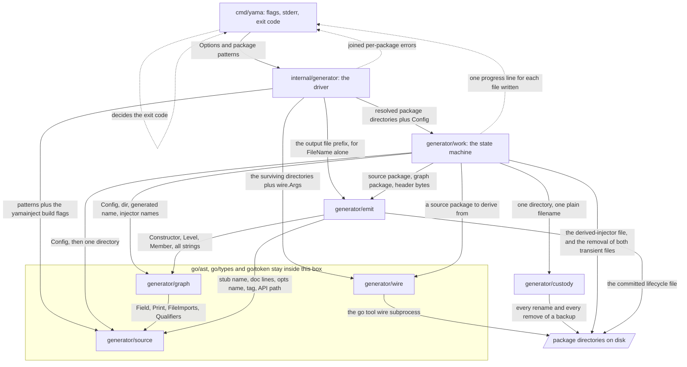
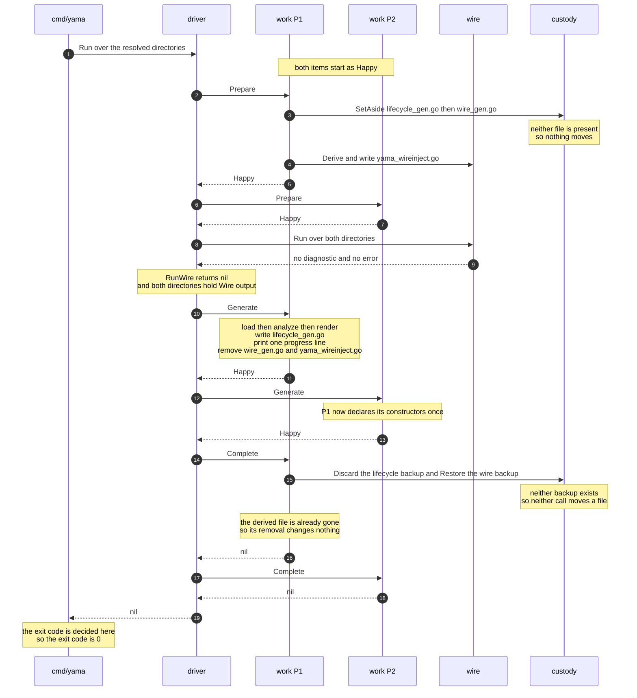
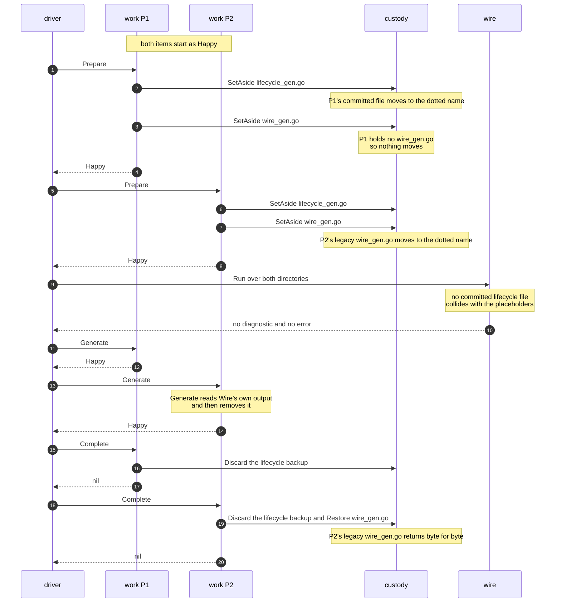
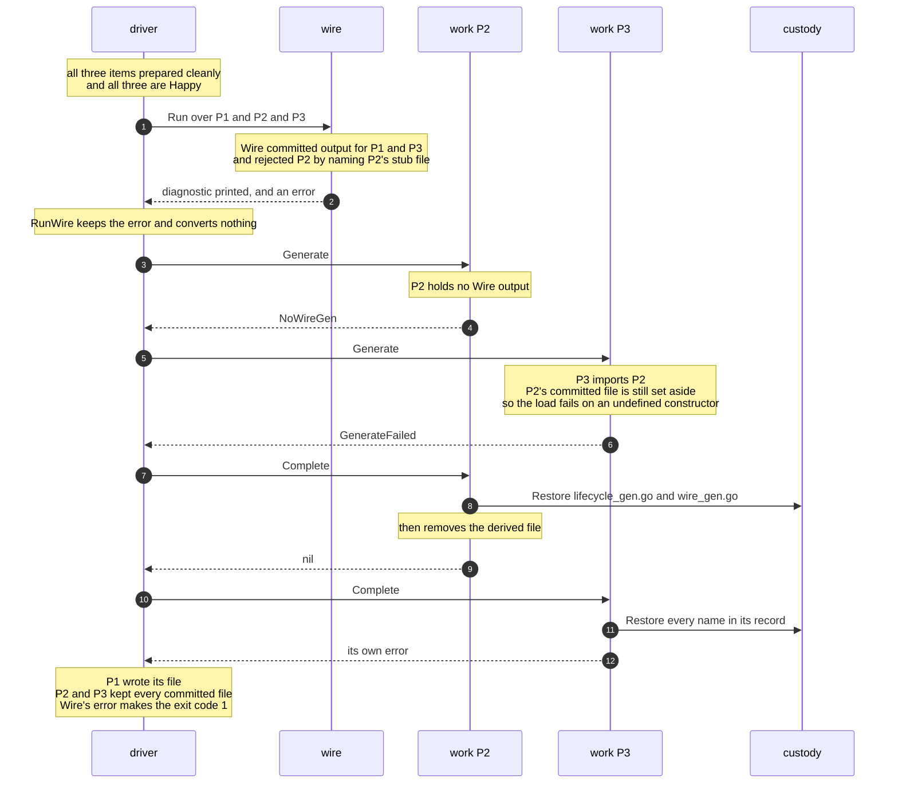
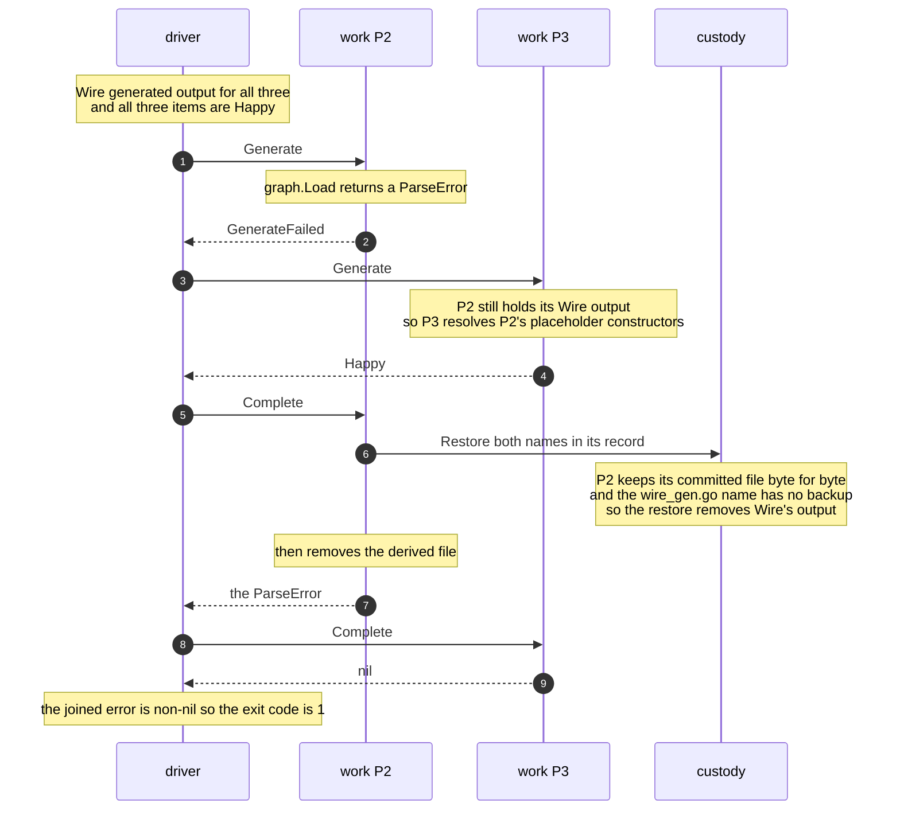
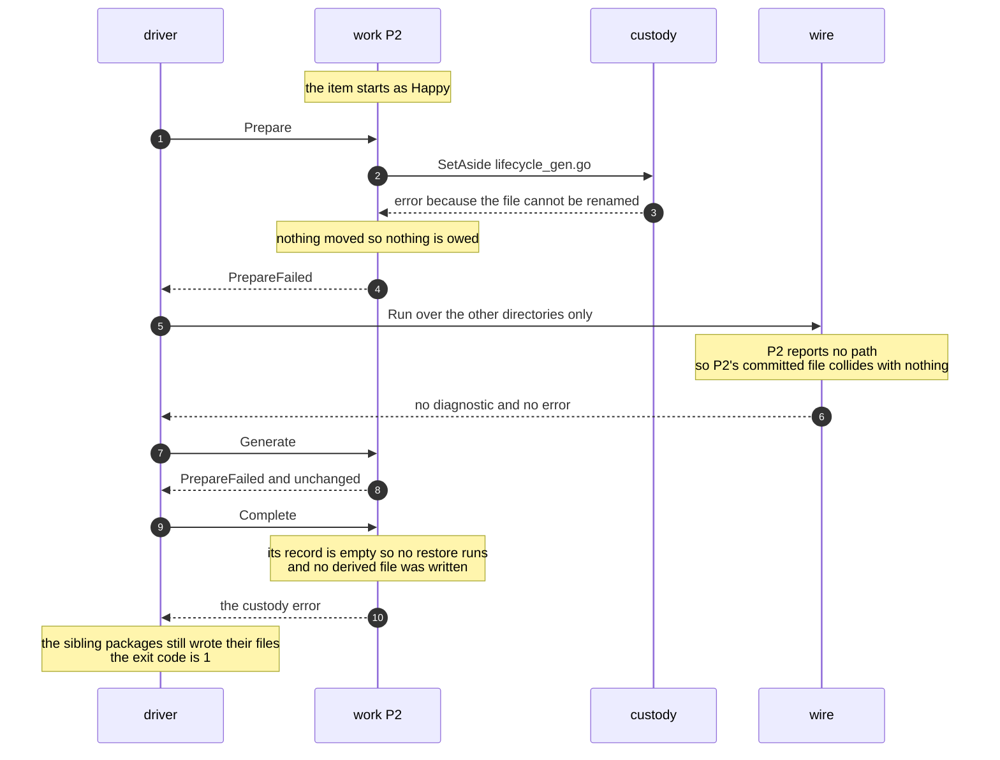
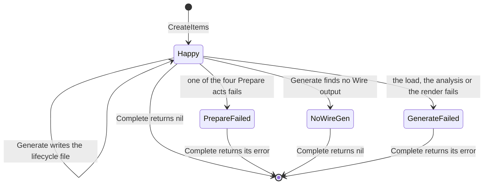

# Yama generator: internal architecture

## Status

The tree holds the generator that this document describes, in `internal/generator`. This document
gives the package boundaries, the exported signatures, and the control flow. It gives no function
bodies. The document preceded the implementation. Where the document and the code disagree, the code
is authoritative.

The public runtime API, `package yama` and `package rt`, is frozen and out of scope. The *content* of
the emitted `lifecycle_gen.go` must not change. Every golden file under
`internal/generator/testdata/emit/<case>/want/` stays valid byte for byte.

Terms used throughout:

- **Lifecycle stub** — a hand-written function behind `//go:build yamainject`, with a body of
  `panic(wire.Build(...))`. It declares a constructor's name, its signature, and its providers.
- **Derived injector** — the Google Wire injector that Yama derives from a stub and writes into a
  temporary file.
- **Lifecycle placeholder** — a second, panicking declaration of the constructor. Yama writes it beside
  the derived injector, so that the package still type-checks while the committed file is set aside.
- **Target package** — one directory that a run emits a lifecycle file for.
- **Work item** — the value that holds one target package's participation in one run. §4 defines it.
- **Tier A** and **tier B** — Google Wire's two failure grains. A tier-A failure is a load failure
  across the whole invocation, and it commits nothing. A tier-B failure is a generate failure in one
  package, and Wire still commits the packages that succeeded. Google Wire's own commit loop in
  `cmd/wire/main.go` is the evidence for both grains. Yama mirrors both grains.

No question is open.

A directory that declares no lifecycle stub stays in the run and needs no state of its own. `Prepare`
sets both generated names aside, so Google Wire cannot overwrite a `wire_gen.go` that the directory
already held. Google Wire receives the directory, finds no injector, writes nothing, and reports
nothing. `Generate` finds no Google Wire output, writes no lifecycle file, and settles the item as a
`NoWireGen`. `Complete` puts back what `Prepare` set aside and returns nil. The directory leaves the
run exactly as it entered, and the run reports nothing about it. §7.6 states why that state is shared
with a package that Google Wire rejected.

---

## 1. What changes and why

`internal/generator` is one package. Seventeen production files hold the design that this document
replaces. `EmitAll` is one function of 74 lines, and that one function runs the whole process.
`EmitAll` resolves patterns. It loads stubs. It looks for files that an interrupted run left behind.
It opens a uniform "scope" over two files that have very different meanings. It writes derived
injectors. It shells out to Google Wire. It parses Wire's output. It analyzes that output. It renders
the lifecycle file. It hands the bytes back to `cmd/yama`, and `cmd/yama` performs the write.

The file layout does not show this layering. `Field` is declared in the wire_gen model file, but
stubs produce it. `LoadedPackage` is declared in the Wire-invocation file, but its only method lives
in the emitter. Multi-package support arrived late, and the code shows this. `multi.go` sits beside
the single-package path. Every failure aborts the whole run, rather than only the package that
failed. Ordering entangles the cleanup logic with the pipeline logic. The committed lifecycle file
survives a failed run only because the deferred `scopes.restore()` runs before `cmd/yama` writes on
top of it.

The new design has six subpackages and a thin driver. Four packages own content. `source` reads and
prints the application's Go source. `wire` derives injectors and invokes Google Wire. `graph` reads
Google Wire's output and computes lifecycle levels. `emit` assembles the lifecycle file and writes
it. A fifth package owns one filesystem convention: `custody` moves a named file aside, puts it back,
or drops what it set aside. The sixth package owns sequence. `work` holds one target package's
participation in the run as a state machine, and the driver runs three loops over the work items.

**The state machine is what removes the complexity.** A run must answer one question repeatedly. What
does this package still hold, and what does it still owe? One alternative answers that question with
data. It keeps one record for each package, and it adds a field for each phase that the package
reached. It then reads those fields back through predicates at settlement time. This design answers
the question by type instead. A package that failed to prepare is a different type from a package that
rendered its file. No value therefore records which phase it reached, and no caller asks.

---

## 2. Package map

The rows are ordered by dependency. Each package depends only on packages that appear above it.

| Import path | Responsibility | Depends on | Deliberately does not know about |
|---|---|---|---|
| `…/generator/custody` | Move a named file in a named directory aside, put that file back, or drop the file that it set aside. | stdlib only | stub, injector, Google Wire, lifecycle, level, build tag, package pattern, phase, whether a run succeeded |
| `…/generator/source` | Resolve which directories hold packages, read and validate each package's lifecycle stubs, and own the vocabulary of a declared Go signature and of the Go source text that Yama reads and writes. | `go/ast`, `go/printer`, `go/token`, `golang.org/x/tools/go/packages` | Google Wire the tool, `wire_gen.go`, component, level, capability, custody, the emitted file's layout, CLI flag names |
| `…/generator/wire` | Render the derived-injector file, and invoke `go tool wire gen` once over a set of directories. | `source` | component, level, capability, cleanup folding, `lifecycle_gen.go`, custody, flag parsing, the phase a package is in |
| `…/generator/graph` | Load Google Wire's output for one directory, extract each injector's dependency graph, detect capabilities, fold cleanups, compute levels, and pre-render every source fragment that a lifecycle constructor needs. | `source` | stub names, doc comments, options parameters, Google Wire the tool, custody, the emitted file's header, tag and import block, CLI flags |
| `…/generator/emit` | Assemble one package's lifecycle file from text fragments, choose the names that its imports and its options parameter bind, format the result, and write it. | `source`, `graph` | `go/ast`, `go/types`, `go/token`, `go/printer`, Google Wire, provider kinds, capabilities, custody, backup names |
| `…/generator/work` | Hold one target package's participation in the run as a state machine, through prepare, generate and complete. Own every file move that the package makes. | `custody`, `source`, `wire`, `graph`, `emit` | package patterns, CLI flags, exit codes, the other packages in the run |
| `internal/generator` | Resolve the patterns, create the work items, run the three loops in order, invoke Google Wire once, and join the errors. | `work`, `source`, `wire`, `emit` | `go/ast`, `go/types`, file moves, backup names, the shape of generated source, terminal output, exit codes |

`custody` holds three exported operations and no types. It also owns the backup naming rule, as a
constant that no caller composes. The naming rule, and the fact that the Go toolchain ignores a file
with a name that starts with a dot, are facts about Go and about the filesystem. They are not facts
about Yama's phases. Six locations inside `work` call these three operations. Two of those locations
call a custody function once for each name in the state's record. A run's total call count therefore
varies with what each package set aside.

The driver imports `emit` for one function. That function is `emit.FileName`, which composes the
emitted file's name from the output-file prefix. §6.7 states the whole rule.

---

## 3. Box diagram



Solid arrows are import edges. Dashed arrows are runtime relationships that create no import.

---

## 4. Control and ownership

### 4.1 The driver's sequence

```go
func NewConfig(opts Options, progress io.Writer) (*work.Config, error)

func NewDriver(dir string, patterns []string, cfg *work.Config) *Driver

func (d *Driver) Run(ctx context.Context) error
func (d *Driver) RunWire(ctx context.Context, items work.Items) error
```

`NewConfig` projects `opts` into the `*work.Config` that a run shares, and it reads the header file
once. `NewDriver` takes that `*work.Config` rather than `Options` itself, so the driver holds no
projection of its own to run: the caller decides once, outside the driver, what a run's stream and
header bytes are.

`Run` resolves the patterns first. It then creates one work item for each target package, through
`work.CreateItems`. It then runs three loops over the items, in this order. The first loop calls
`Prepare` on each item, and it stores the returned `State` at that item's index. The second loop
calls `Generate` the same way. The third loop calls `Complete` on each item, and it collects the
errors.

Between the first loop and the second, `Run` invokes `d.RunWire(ctx, items)` and keeps the error that
call returns. `Run` returns `errors.Join` over that error and the errors the third loop collected. A
run therefore has two error channels, and both of them are bare signals.

`CreateItems` gives every item the run's configuration, which carries the two generated filenames,
the header bytes, and the progress writer. Every item starts in the `Happy` state, so the driver
performs no classification of its own.

`RunWire` has a small contract. It asks the items for their directories, and it invokes Google Wire
once over those directories. It prints Google Wire's own diagnostic when Wire produced one, at the
point where it happened. It converts no item, and it inspects no directory.

`RunWire` returns an error when Google Wire failed, at either grain. That error is what makes the run
exit 1. It carries no detail, because Google Wire already printed the diagnostic that names the
rejected package and states the reason. Q-K states the rule that keeps every error in this design a
bare signal.

An item classifies itself instead. `Happy.Generate` reads its own directory, and it returns a
`NoWireGen` when it finds no Google Wire output. The classification therefore happens at the point
where it first matters, and no pass over the items runs between Google Wire and the `Generate` loop.
Q-H states why that is enough.

### 4.2 The work item and its states

A work item is one target package's participation in one run. Every work item satisfies one
interface:

```go
type State interface {
	PackagePath() (path string, runWire bool)
	Prepare() State
	Generate() State
	Complete() error
}

type Items []State

func (items Items) Paths() []string
```

`Prepare` and `Generate` each return a `State`. A phase that succeeds returns the same value. A phase
that fails returns a value of a different type, and that type declines the rest of the run. The item
therefore records no phase, holds no error flag, and needs no predicate.

`Items.Paths` returns the directories of the items that report `runWire`. A failed state reports
`runWire == false`, so it drops out of the set that goes to Google Wire, and the driver filters nothing
itself.

Every `Complete` also removes the derived-injector file, and §4.3 states that rule once for all four
states.

| State | Reached when | What it holds | What `Complete` does |
|---|---|---|---|
| `Happy` | every phase so far succeeded | the directory, the config pointer, the source package, the names it prepared | drops the lifecycle backup, restores the `wire_gen.go` backup, removes the derived-injector file, returns nil |
| `PrepareFailed` | a file could not be set aside, the stub load failed, or the derived file could not be built or written | the directory, the config pointer, the names it prepared, the error | restores every name in its record, removes the derived-injector file, returns the error |
| `NoWireGen` | `Generate` found no Google Wire output in this directory | the directory, the config pointer, the names it prepared | restores every name in its record, removes the derived-injector file, returns nil |
| `GenerateFailed` | the load, the analysis, the render or the write failed | the directory, the config pointer, the names it prepared, the error | restores every name in its record, removes the derived-injector file, returns the error |

`NoWireGen` returns nil, and it is the one terminal state that does. It covers two directories that
look the same on disk. Google Wire rejected the first, and the second declared no stub, so Google
Wire had nothing to generate for it. Neither directory can be told from the other by what it holds,
and neither needs to be: `RunWire` already returned the error that makes a rejected run exit 1, so
`NoWireGen` owes the run nothing beyond putting the package's files back.

Two properties hold across the three terminal states. `Complete` restores every name in the state's
own record, and "the names it prepared" is the record of the filenames that the package set aside,
which §7.1 defines exactly. Every terminal state reports `"", false` from `PackagePath`, so none of
them reaches a Google Wire run.

`PackagePath` is the one method that every state answers, so `Items.Paths` is safe to call at any
point of the run.

A terminal state declares only the phase methods the driver still calls after that state can exist.
Every other phase method panics. `PrepareFailed` can exist before `Items.Paths` runs, so it answers
`Generate` with itself. `NoWireGen` and `GenerateFailed` first exist inside the `Generate` loop, so
`Complete` is the only phase call either one ever receives, and their other two phase methods panic.
§7.2 states the loop order those panics depend on.

A directory that declares no lifecycle stub reaches `Generate` as a `Happy`, and `Generate` settles
it as a `NoWireGen`, because Google Wire wrote nothing there. §7.6 states what each of its phases
does.

### 4.3 The three phases

**`Prepare`** runs before Google Wire. It loads the package's lifecycle stubs. It sets
`lifecycle_gen.go` aside, and then it sets `wire_gen.go` aside. It derives the injectors, and it
writes `yama_wireinject.go`. Four failures return `PrepareFailed`. Those failures are a failed stub
load, a failed move, a failed derivation, and a failed write of the derived file.

**`Generate`** runs after Google Wire. It loads Wire's output for this directory, it analyzes that
output, it renders the lifecycle file, and it writes the file. It prints one progress line for the
file it wrote, at the point of the write. Any failure returns `GenerateFailed`.

`Generate` removes `wire_gen.go` and `yama_wireinject.go` only after it wrote the lifecycle file. A
package that failed to render therefore keeps Google Wire's output for the rest of the `Generate`
loop. Google Wire copied the placeholder constructors into that output, so a package that imports the
failed package still resolves them. §7.5 states which call clears those files afterward.

`Generate` reads the directory for Google Wire's output before it does anything else. It returns a
`NoWireGen` when it finds none. That branch is the whole of the design's response to a rejected
package, and it is also the whole of its response to a package that had nothing to generate.

**`Complete`** settles the backups, it removes the derived-injector file, and it returns this
package's error. The derived-injector removal is a plain removal of `wire.DerivedFileName`, not a
custody call, because that file has no backup. Every state performs it, so no failure path leaves the
file in the user's tree. The removal is already a no-op for a `Happy` item, because `Happy.Generate`
removed the file. The file carries `//go:build wireinject`, and only Google Wire's own load sets that
tag. Every load after Google Wire runs ignores the file, so this removal can wait until settlement
without changing what any package reads.

### 4.4 Who owns what

| Owner | Owns |
|---|---|
| `custody` | the backup naming rule, and the three moves that implement it |
| `source` | package resolution under the yamainject build flags, stub validation, and the shared Go-source vocabulary |
| `wire` | the derived-injector file's text, the `//line` directives, and the one `go tool wire gen` invocation |
| `graph` | every value from `go/ast`, `go/token` and `go/types` that Wire's output produces, and every fragment that the emitter needs, pre-rendered as text |
| `emit` | the emitted file's name, its layout, its imports, its formatting, and its bytes on disk |
| `work` | the phase order for one package, every custody call, the two transient files that live in a package directory, and the progress line for each file written |
| the driver | pattern resolution, item creation, the three loops, the single Wire invocation, and the joined error |
| `cmd/yama` | flag parsing, the stderr stream, and the exit code |

Two ownership rules are grep-checkable. Only `work` moves a file, so `custody.SetAside`,
`custody.Restore` and `custody.Discard` appear in no other package. Only `emit` writes the lifecycle
file, so the write no longer happens in `cmd/yama`.

### 4.5 Why the driver is thin, and what would signal that it is not

The driver holds three loops, one call between the first loop and the second, and one `errors.Join`.
It reads no file, it moves no file, and it inspects no item. It never asks an item what happened,
because an item's type already answers that.

Five signals would mean that the driver stopped being thin. Any one of them is a defect.

- The driver reads a file, writes a file, or composes a path inside a package directory.
- The driver branches on an item's concrete type, or on what is on disk.
- The driver inspects an error with `errors.As` to decide what to do next.
- The driver holds a fourth loop over the items, or a loop that filters them.
- `Options` reaches a subpackage whole, rather than as the projection that the subpackage needs.

### 4.6 The ordering rules this design depends on

No type expresses any of these four rules. Each rule therefore needs a test, and each one belongs in
the ADR.

**Rule 1. Yama sets the committed lifecycle file aside before Google Wire runs.** The committed file
carries `//go:build !yamainject`, and Google Wire's own load sets neither build tag. The committed
file therefore reaches that load, where it collides with the lifecycle placeholders in the derived
file. A duplicate declaration is a load error, and a load error is tier A. A tier-A failure commits
nothing for any package in the invocation, so one stale file would cost every sibling its output.
`Happy.Prepare` sets the file aside, so Wire's load sees the placeholders alone.

This rule is also why a `PrepareFailed` package must be absent from `Items.Paths`. That package still
holds its committed file on disk, so it must report no path and must stay out of the invocation.

**Rule 2. `Prepare` sets `lifecycle_gen.go` aside before it sets `wire_gen.go` aside.** This order
bounds the damage of a failed move. Under this order, a failure on the first move leaves nothing set
aside, so the package loses nothing. A failure on the second move leaves `lifecycle_gen.go` under a
backup name. A later failure to put that file back costs the user a file, and the next successful run
recreates it. Under the opposite order, a failure on the first move would leave a legacy
`wire_gen.go` under a backup name, and Yama cannot recreate that file. The order therefore risks
only the file that Yama can recreate.

**Rule 3. `Happy.Generate` writes the lifecycle file and removes Wire's output before it returns.** By
the time `Generate` returns, the directory holds `lifecycle_gen.go` and holds neither `wire_gen.go`
nor `yama_wireinject.go`. That package therefore declares its constructors exactly once. A package
that `Generate` visits later in the same loop, and that imports this package, resolves those
constructors without ambiguity. The later package loads with type information, and it resolves a
same-module import from source rather than from export data. One loop that visits one package at a
time is what makes the removal sufficient. A concurrent `Generate` loop would break this rule.

**Rule 4. A rejected package holds its committed lifecycle file at the backup name until `Complete`.**
A package that Google Wire rejected holds no Wire output, so it holds no lifecycle placeholder
either. Its committed file stays under the dotted backup name for the whole `Generate` loop. A
package that imports it, and that `Generate` visits later, therefore fails to type-check. This
design accepts that second failure.

A measurement over `internal/generator/testdata/crosspkg` gives the cost a number. That fixture's
`app/use.go` is untagged, and it calls `lib.NewLibLifecycle`. With `lib`'s `lifecycle_gen.go`
present and no `wire_gen.go` beside it, `app` loads with zero errors. With `lib`'s
`lifecycle_gen.go` held at the dotted name, `app` fails at `app/use.go:26:13` with
`undefined: lib.NewLibLifecycle`.

The cost is one message, and the run already fails. Google Wire rejected `lib`, so the run exits 1
whatever `app` does. `app` settles as a `GenerateFailed`, and that state restores its backup names,
so `app` loses no committed file. Q-H states why an earlier restore does not pay for itself.

---

## 5. Swimlanes

Each diagram names the concrete state that each item holds after each transition.

### 5.1 Happy path, two packages, first run



### 5.2 Refresh, with a legacy `wire_gen.go` in one package



### 5.3 Google Wire rejects one package of three



### 5.4 The render fails in one package of three



### 5.5 A file cannot be set aside in one package



---

## 6. Package detail

### 6.1 `internal/generator/custody`

```go
const BackupPrefix = ".yama."

func SetAside(dir, name string) error
func Restore(dir, name string) error
func Discard(dir, name string) error
```

Custody declares three functions, one constant, and no type.

`SetAside` moves `dir/name` to the backup name. `SetAside` leaves a directory that holds no such file
as it is, and it returns nil. `Restore` moves the backup back over the name. `Restore` removes the
name when no backup exists, and it returns nil when neither file exists. `Discard` removes the backup
and leaves the name alone. A missing backup is not an error.

The removal inside `Restore` carries weight in this design. A state can hold a name in its record that
never had a backup, and that state uses this removal to clear a transient file. §7.5 names the case.

Each function returns an error that names the operation, the directory, and the file. No caller
matches on that error, so custody declares no error type. The state that owns the file reports the
error, and the driver joins it.

The leading dot keeps the Go toolchain from reading the backup as a source file. That property is why
a backup can sit beside a regenerated file without colliding with it.

`BackupPrefix` is a constant of this package, not a parameter. Custody owns the naming rule, and no
caller composes a backup name. Every function names a directory and a plain filename. Nothing in this
package says stub, injector, Wire, lifecycle, or run.

The backup naming rule and the dot-file rule are facts about Go and about the filesystem. They are not
facts about a phase of a Yama run. Six places in `work` need them.

May not import: anything outside the standard library.

### 6.2 `internal/generator/source`

```go
const Tag = "yamainject"
const DerivedPrefix = "yama_"
const APIPath = "l7e.io/yama/v2"
const OptionTypeName = "Option"
const LifecycleTypeName = "Lifecycle"
const GeneratedHeader = "// Code generated by Yama. DO NOT EDIT."
const LineDirectivePrefix = "//line "

var ErrNoStubs error
var ErrNoPackages error

type Config struct{ Tags string }

func (c Config) BuildFlags() []string

func Resolve(ctx context.Context, cfg Config, dir string, patterns []string) ([]string, error)
func Load(ctx context.Context, cfg Config, dir string) (*Package, error)

type Package struct {
	Dir         string
	PkgName     string
	PkgPath     string
	Fset        *token.FileSet
	Stubs       []*Stub
	ImportNames map[string]string
}

func (p *Package) DerivedNames() []string

type Stub struct {
	Name     string
	Doc      []string
	Params   []Field
	Results  []Field
	Build    *ast.CallExpr
	HasOpts  bool
	File     *ast.File
	FuncDecl *ast.FuncDecl
}

func (s *Stub) DerivedName() string
func (s *Stub) GraphParams() []Field
func (s *Stub) OptsName() string
func (s *Stub) ResultType() ast.Expr

type Field struct {
	Name string
	Type ast.Expr
}

func Fields(list *ast.FieldList) []Field
func Print(fset *token.FileSet, node ast.Node) string
func PrintFields(fset *token.FileSet, fields []Field) string
func FileImports(file *ast.File, known map[string]string) map[string]string
func Qualifiers(nodes ...ast.Node) map[string]bool
func LineDirective(fset *token.FileSet, pos token.Pos) string

type Error struct {
	Stub string
	Pos  token.Position
	Msg  string
}

func (e *Error) Error() string
func NewError(fset *token.FileSet, s *Stub, pos token.Pos, format string, args ...any) *Error
```

**The package name.** The package doc comment states one charter in one sentence. `source` reads and
prints the application's Go source. A lifecycle stub is a declaration inside that source, and `Stub`
is a type inside this package. `Stub` is not the package's subject.

`Stub.Doc` holds each comment line as the source carries it. This includes markers.

`Resolve` fails with `ErrNoPackages` when a pattern matches nothing. The detection rule has three
parts. `Resolve` reads the errors that `packages.Load` reports. An error that says no packages matched
maps to `ErrNoPackages`. Any other reported error surfaces joined and unchanged. A load that yields no
package carrying Go files, with nothing reported, also maps to `ErrNoPackages`.

`Load` returns `ErrNoStubs` for a directory that declares no stubs. On a validation failure, `Load`
returns a non-nil `*Package` carrying `Dir` and `PkgPath`, alongside the error.

`Config.BuildFlags` composes `-tags=yamainject` with the user's tags. This is the one place that
composition happens, and `source`'s own tests assert it.

`GeneratedHeader` and `LineDirectivePrefix` sit here because both files Yama writes carry them, and
their two writers, `wire` and `emit`, share only this one leaf package. `LineDirective` renders the
directive that binds a generated declaration back to its stub position.

May not import: `custody`, `wire`, `graph`, `emit`, `work`, `os/exec`.

### 6.3 `internal/generator/wire`

```go
const InjectTag = "wireinject"
const DerivedFileName = "yama_wireinject.go"

type Args struct {
	OutputFilePrefix string
	Tags             string
}

func (a Args) Flags() []string
func OutputName(prefix string) string

func Derive(sp *source.Package) ([]byte, error)
func Run(ctx context.Context, wd string, dirs []string, args Args) (*Result, error)

type Result struct {
	Diagnostic string
	Err        *ToolError
}

type ToolError struct {
	Dir    string
	Stderr string
	Err    error
}

func (e *ToolError) Error() string
func (e *ToolError) Unwrap() error

type ToolchainError struct {
	Stderr string
	Err    error
}

func (e *ToolchainError) Error() string
func (e *ToolchainError) Unwrap() error
```

`Args` carries two fields, not three. Yama stops passing `-header_file` to Google Wire. That flag puts
the user's header on the temporary file that Google Wire generates, and nobody ever reads that file.
§6.5 gives the header content to `emit` instead.

**`Derive` and `Run` are separate, because two different callers need them.** `Derive` renders one
package's derived-injector file: the derived injector, the placeholder constructor, and a
`source.LineDirective` before each one. A work item calls `Derive` during `Prepare`, and the work item
writes the file, because the work item owns every file that its package holds. `Run` invokes the
subprocess, and the driver calls it once for the whole run.

The line directive makes Google Wire report a position in the hand-written stub file. The Go toolchain
honors the directive, and Google Wire uses the Go toolchain, so Yama computes no position and adjusts
none. `Run` still rewrites the injector *name*, because a directive cannot fix a name, and the derived
name is one Yama invented.

`Run` states two preconditions. Google Wire's output name is vacant in every directory that `Run` is
given. And `dirs` is not empty. An empty slice is a programming error, and `Run` rejects it. Otherwise
`Run` would fall through to `wire gen`'s default pattern of `.`, and Google Wire would write its
output into the caller's own directory.

`Run` computes the patterns that the subprocess needs, relative to `wd`. That conversion is
Wire-invocation knowledge, and it stays invisible outside this function.

The `error` that `Run` returns is tier A. It carries a `*ToolchainError`, meaning the tool could not
run at all. Everything that Google Wire itself reported is data on `Result`. `RunWire` prints what
`Result` holds, and it reports a failure of either grain to its own caller as one bare error. A
tier-A failure is that error being non-nil. A tier-B failure is `Result` naming at least one rejected
package. `RunWire` therefore reads `Result` to decide whether a run failed, and it reads no error
value to decide anything.

May not import: `custody`, `graph`, `emit`, `work`, `go/types`.

### 6.4 `internal/generator/graph`

```go
type Config struct{ Tags string }

func (c Config) BuildFlags() []string

func Load(ctx context.Context, cfg Config, dir, generated string, injectors []string) (*Package, error)

type Package struct {
	Dir          string
	Constructors []Constructor
	BodyImports  map[string]string
	Reserved     []string
}

func (p *Package) For(injector string) *Constructor

type Constructor struct {
	Injector   string
	Params     string
	ParamNames []string
	Result     string
	Body       []string
	Root       string
	Idents     []string
	Levels     []Level
}

type Level []Member

type Member struct {
	Kind      MemberKind
	Component string
	Cleanup   string
}

type MemberKind int

const (
	MemberComponent MemberKind = iota
	MemberCleanableComponent
	MemberCleanup
)

func (k MemberKind) String() string

type LoadError struct {
	Dir string
	Err error
}

func (e *LoadError) Error() string
func (e *LoadError) Unwrap() error

type ParseError struct {
	Injector string
	Pos      token.Position
	Msg      string
}

func (e *ParseError) Error() string

type AnalysisError struct {
	Injector string
	Pos      token.Position
	Msg      string
}

func (e *AnalysisError) Error() string
```

`Load` takes injector names, not a source package. Because of this, the whole analysis fixture corpus
can drive `Load` without a stub file. `Load` blanks every comment that begins with
`source.LineDirectivePrefix`, only in the file named by `generated`. A position that Yama reports
therefore names Yama's own file, and not the stub file that Google Wire's directive points back to.

`Config.BuildFlags` composes the parse-time build flags. These flags set neither `wireinject` nor
`yamainject`. `graph`'s own tests assert this composition.

Every syntax type stays inside `graph`. `Component`, `Cleanup`, `ProviderKind`, and `Capabilities` are
unexported. Every fragment the emitter needs is already text. Cleanup rebinding happens inside `Load`,
before `Load` hands anything over. From that point on, the returned `Package` is read-only, and it
holds no live node.

Four fields carry what the emitter would otherwise read from live data. Each field has an exact
definition:

- `Params` is the injector's parameter list, rendered as source, with the trailing options parameter
  left out. `ParamNames` is the same list's parameter names, in order. The two fields are separate
  because `emit` renders one field and binds the other into its name scope.
- `Body` holds one entry for each construction statement, printed at the left margin. A `wire.Value`
  or `wire.InterfaceValue` in the entry is already rematerialized as its own initializer.
- `Idents` is every identifier that appears in the re-emitted body and in the result expression.
  `Idents` does **not** include parameter names. `ParamNames` carries those names instead.
- `Reserved` is every name declared in the application's package block **and** every predeclared
  identifier of the Go universe. ADR-013's collision scope requires both sets of names. Today's
  emitter reaches the predeclared identifiers through `types.Scope.LookupParent`, which walks past the
  package scope into Universe. If `Reserved` held only package-block names, the emitter would claim
  `error` or `len` as an import name.

ADR-013's scope also holds every constructor name, and `Reserved` is not the channel for those names.
`emit` reads each constructor name from `source.Package.Stubs`, which `Render` already takes. Each
constructor name does also appear in `Reserved`. Google Wire copies each placeholder declaration into
its output, and `graph.Load` reads that declaration in the package block. That second route is
incidental, and this design does not depend on it.

May not import: `custody`, `wire`, `emit`, `work`, `os/exec`.

### 6.5 `internal/generator/emit`

```go
const BaseFileName = "lifecycle_gen.go"
const Directive = "//go:generate go tool yama"

func FileName(prefix string) string

func Render(sp *source.Package, gp *graph.Package, header []byte) []byte
func Write(dir, name string, content []byte) (string, error)
```

**The file name is composed, not fixed.** ADR-012 substitutes Yama's artifact for Google Wire's
throughout, so `-output_file_prefix` applies to the file Yama emits. `FileName("foo_")` yields
`foo_lifecycle_gen.go`. `FileName` mirrors `wire.OutputName`. The default prefix is empty, so no
golden fixture changes. Yama still passes `-output_file_prefix` to Google Wire. That flag makes Google
Wire's temporary output name match a legacy prefixed `wire_gen.go`, and it makes the work item set the
right name aside.

**`Render` takes the header content as an input.** `header` holds the bytes of the file that
`-header_file` names, and it is nil when the user passed no such flag. `Render` writes those bytes
first, above Yama's own `source.GeneratedHeader` provenance line. The driver reads that file once per
run, and it passes the same bytes to every package.

`Render` then assembles the `//go:generate` directive, a build constraint composed from `source.Tag`,
the package clause, the import block, and one constructor for each stub. It runs `go/format` over the
result. It indents the first line of each `Body` entry, and it leaves continuation lines alone.
`go/format` normalizes statement indentation, and it leaves the interior of a raw string literal
untouched. Every way `Render` can fail is a Yama bug, and each one stays a panic.

`Render` takes three arguments, and every one of them is data. `emit` therefore stays testable from
literal values, with no Go toolchain and no `go tool wire`.

`Write` takes a directory and a plain filename, so `emit` composes no path from a prefix and never
learns a backup name. It returns the path that it wrote.

May not import: `go/ast`, `go/token`, `go/types`, `go/printer`, `golang.org/x/tools/go/packages`,
`custody`, `wire`, `work`.

### 6.6 `internal/generator/work`

```go
type Config struct {
	Source        source.Config
	Graph         graph.Config
	WireArgs      wire.Args
	WireOutput    string
	LifecycleFile string
	Header        []byte
	Progress      io.Writer
}

type State interface {
	PackagePath() (path string, runWire bool)
	Prepare() State
	Generate() State
	Complete() error
}

type Items []State

func (items Items) Paths() []string

func CreateItems(dirs []string, cfg *Config) Items

type Happy struct{ /* unexported */ }
type PrepareFailed struct{ /* unexported */ }
type NoWireGen struct{ /* unexported */ }
type GenerateFailed struct{ /* unexported */ }
```

Each of the four types satisfies `State`, and each declares the four methods. §7 gives every legal
transition and every settlement.

`Config` is the run's whole configuration, projected once by `NewConfig` and shared by every item. An
item holds a pointer to it. `WireOutput` and `LifecycleFile` are plain filenames, so an item hands
custody a name that custody cannot interpret.

`CreateItems` allocates one item for each resolved directory, and every item starts as a `Happy` that
holds the directory and the config. The factory reads no file, and it classifies nothing.

`PackagePath` reports the directory that holds the target package. It also reports whether that
package takes part in the Google Wire invocation. `Items.Paths` collects the directories of the items
that report `runWire`, so the driver never filters the list itself.

`Progress` is where a `Happy` item writes its own progress line, in the shape Google Wire uses for its
own: `yama: <import path>: wrote <path>`. The import path comes from `source.Package.PkgPath`, which
the item loaded during `Prepare`. The line is promised behavior under ADR-012, so a test must be able
to capture it. `NewConfig` fills this field from the stream its caller passed. `cmd/yama` passes
`os.Stderr`, and a test passes a buffer. Output happens where it is produced, and the error that `Run`
returns is a signal for the exit code rather than a message.

`Happy.Generate` inspects its own directory for Google Wire's output, and it returns a `NoWireGen`
when it finds none. That check is the first act of `Generate`, before the load and before any write.
No other function in the package classifies an item, and no `Items` method does.

**The state needs no stub count.** A directory that declares no stub gives Google Wire nothing to
generate, so Google Wire writes no output there. A directory that Google Wire rejected also holds no
output. Both reach `NoWireGen`, and `NoWireGen` settles both the same way: it restores every name in
its record and it returns nil. The two cases need no telling apart, because the run's exit code comes
from the error `RunWire` returned rather than from a per-package error. Q-K states that rule.

**Only `Happy` transitions.** The three terminal states each declare only the phase methods the driver
can still call on them, and every other phase method panics. Every one of them answers `PackagePath`.
§4.2 states which methods those are for each state, and §7.2 states the loop order those panics
depend on.

**Only `work` moves a file in a package directory.** Six state methods call `custody`. Three of them
call `custody` once for each name in the state's record. The number of calls a run makes therefore
varies with what each package set aside. No other package in the tree calls `custody`, and that
property is checkable by grep.

**Only `work` removes the two transient files.** `Happy.Generate` removes them after it wrote the
lifecycle file, and every `Complete` removes the derived-injector file. Both removals take the live
name, so both are plain removals rather than custody calls.

May not import: `internal/generator`.

### 6.7 `internal/generator` — the driver

```go
type Options struct {
	OutputFilePrefix string
	HeaderFile       string
	Tags             string
}

func (o Options) sourceConfig() source.Config
func (o Options) graphConfig() graph.Config
func (o Options) wireArguments() wire.Args
func (o Options) wireOutputName() string
func (o Options) lifecycleFileName() string

func NewConfig(opts Options, progress io.Writer) (*work.Config, error)

type Driver struct{ /* unexported */ }

func NewDriver(dir string, patterns []string, cfg *work.Config) *Driver

func (d *Driver) Run(ctx context.Context) error
func (d *Driver) RunWire(ctx context.Context, items work.Items) error
```

`wireArguments` carries a name `Options` itself did not free. The pre-existing `internal/generator`
package already declares `func (o Options) wireArgs() []string` for the legacy pipeline that this
design replaces, so the driver's own projection needs a name of its own until that pipeline is
deleted. Every other projection keeps the name this document gives it.

`Run` does five things. It resolves the patterns, it creates the items, and it runs the three phases
in order. It invokes Google Wire between the first phase and the second, and it joins the errors. It
holds no per-package state, it moves no file, it composes no path, and it inspects no error to decide
what to do next. §4.5 lists the five signals that would mean the driver has stopped being thin.

`Options` never leaves `internal/generator` whole. `NewConfig` is the one function that takes it
apart, and each field's projection is its own method, asserted directly by a table test. The current
tree already uses the projection pattern. `internal/generator/wire.go`, lines 58 to 102, already
declares `wireGenName`, `wireArgs`, `stubBuildFlags`, and `parseBuildFlags` as `Options` methods, and
`multi_test.go` already asserts two of them. The tag composition itself moves into `source.Config` and
`graph.Config`, so those two assertions move with it.

`lifecycleFileName` calls `emit.FileName`, and `wireOutputName` calls `wire.OutputName`. `NewConfig`
composes neither name itself. Both rules stay in the package that owns the file, and `NewConfig` holds
one import for each of them.

Every field of `Options` mirrors one of `wire gen`'s own flags. The run's message stream is not a
flag, so it is not a field of `Options`. It is `NewConfig`'s own second parameter instead, and
`NewConfig` copies it onto the `*work.Config` that it returns. `cmd/yama` calls `NewConfig` with the
flags it parsed and `os.Stderr`. A test in the driver's own package calls it with a buffer. `Driver`
therefore never holds an `Options` value, and it never chooses a stream on its own: `NewDriver` takes
the `*work.Config` that `NewConfig` already built.

`RunWire` invokes `wire.Run` over `items.Paths()`, using the `wire.Args` that `d.cfg.WireArgs` already
holds, and it prints Google Wire's diagnostic when there is one. If `Paths` is empty, `RunWire`
invokes no subprocess and returns nil. `RunWire` reads `d.cfg` rather than projecting `Options`
again, so a run builds its configuration exactly once.

`RunWire` takes the items only to ask them for their directories. It returns no items, because it
converts none. An item that Google Wire rejected classifies itself, at the top of its own `Generate`.

`RunWire` returns an error when Google Wire failed at either grain, and that error is the run's
signal to exit 1. It names nothing and wraps nothing. `Run` joins it with what the third loop
returned.

May not import: `go/ast`, `go/token`, `go/types`, `golang.org/x/tools/go/packages`, `custody`,
`graph`.

---

## 7. The state machine

One work item is one target package's participation in one run. The item is a `State` value, and the
driver holds it in `Items` at a fixed index. `Prepare` and `Generate` return a `State`, so the driver
replaces the value at that index with whatever the call returned. The item therefore records no phase
number, holds no error flag, and needs no predicate.

`Happy` is the only state that transitions. Three states are terminal. A terminal state answers
`Prepare` and `Generate` with itself, it reports `runWire` as false from `PackagePath`, and it settles its
own files in `Complete`.

### 7.1 What each state holds

| State | Fields | Reached when |
|---|---|---|
| `Happy` | the directory, the config pointer, the loaded `*source.Package`, the names it prepared, the path it wrote | the run did not fail for this package |
| `PrepareFailed` | the directory, the config pointer, the names it prepared, the error | the stub load failed, a set-aside failed, `wire.Derive` failed, or the write of the derived file failed |
| `NoWireGen` | the directory, the config pointer, the names it prepared | `Generate` found no Google Wire output in this directory |
| `GenerateFailed` | the directory, the config pointer, the names it prepared, the error | the load, the analysis, the render, or the write failed |

"The names it prepared" is the ordered record of the filenames for which `custody.SetAside` returned
nil. The record drives every later restore. A state restores exactly the names in its own record, and
it restores nothing else. A `Happy` item that set no file aside therefore owes nothing, and its
successor state owes nothing either.

The record holds two names when `wire.Derive` or the derived-file write is what failed, because both
set-asides already succeeded. That `PrepareFailed` can also hold a partly written derived file. Its
`Complete` removes that file, as every `Complete` does.

`NoWireGen` holds the same record as the `Happy` it replaced, and it holds no error. Nothing about
the package changed when `Generate` looked at the directory. The record is what it set aside during
`Prepare`, and `NoWireGen.Complete` restores all of it.

### 7.2 Every legal transition

| State | `PackagePath` | `Prepare` | `Generate` | `Complete` |
|---|---|---|---|---|
| `Happy`, before `Prepare` | the directory, true | `Happy` or `PrepareFailed` | not reached | not reached |
| `Happy`, after `Prepare` | the directory, true | not called again | `Happy`, `NoWireGen`, or `GenerateFailed` | drops the lifecycle backup, restores the Wire backup, removes the derived file, returns nil |
| `PrepareFailed` | `"", false` | panics | itself | restores every name in its record, removes the derived file, returns its error |
| `NoWireGen` | `"", false` | panics | panics | restores every name in its record, removes the derived file, returns nil |
| `GenerateFailed` | `"", false` | panics | panics | restores every name in its record, removes the derived file, returns its error |

The panics in that table are safe because `Run` calls the phases in one fixed order: the `Prepare`
loop, then `RunWire`, then the `Generate` loop, then the `Complete` loop. `Items.Paths` runs inside
`RunWire`, so it reaches a `PrepareFailed` and never reaches the two states that `Generate` creates.
`Prepare` runs once for each item, so no state that `Prepare` produced receives `Prepare` again. A
change to that order turns each of these panics into a crash, which is the report the design wants.

`Prepare` loads the package's lifecycle stubs first, and it moves no file before that load returns. It
then sets `lifecycle_gen.go` aside, and then it sets Google Wire's output name aside. It renders the
derived-injector file through `wire.Derive`, and it writes that file. Each of those four acts returns
`PrepareFailed` when it fails. A directory that declares no stub still sets both names aside, and §7.6
states why.

`Generate` loads Google Wire's output through `graph.Load`, renders the lifecycle file through
`emit.Render`, and writes it through `emit.Write`. It removes Google Wire's output and the
derived-injector file after the write succeeds, and it returns `Happy`. A `Generate` that fails
removes neither file, so the package keeps Wire's output for the rest of the loop. §4.3 states which
package that helps, and §7.5 states which call clears the two files afterward.

The removal of Google Wire's output and the removal of the derived-injector file both take the live
name, not the backup name. Both are therefore plain removals rather than custody calls.

`Generate` tests the directory for Google Wire's output before it loads anything, and it returns a
`NoWireGen` when it finds none. That test is one branch in one method, and it is the only place in
the tree that asks the question.



### 7.3 A failed package is a different type

The state's type carries the outcome, and no field carries it. Each type declares the settlement that
its own situation needs, and the compiler holds each one to the whole interface. A reader who wants to
know what a rejected package does with its files reads one type.

This shape also removes the filtering step. Google Wire must receive the directories of the packages
that are still in the run. `Items.Paths` builds that list from `PackagePath`, and every terminal state
reports `runWire` as false. The driver therefore hands `Paths` straight to `RunWire`, and it never tests a
state for what kind it is.

The rule that keeps the set of states small is simple. A new state is admitted only when it settles
its files differently from every existing state. `NoWireGen` restores every name in its record and
returns nil. `Happy` discards its lifecycle backup, and the two failed states return an error. No
other state restores everything and stays silent, so `NoWireGen` is a type.

### 7.4 The backup name and the set-aside order

A set-aside moves `name` to `.yama.name` in the same directory. The Go toolchain ignores a file with a
name that starts with a dot. A backup therefore sits beside a regenerated file without colliding with it,
and a load treats "set aside" and "never existed" as the same state.

`Prepare` sets `lifecycle_gen.go` aside first, and Google Wire's output name second. Rule 2 of §4.6
states how that order bounds the damage of a failed move.

### 7.5 What each state settles

`Happy.Complete` discards the lifecycle backup, because the freshly emitted file replaced it. It
restores the Wire backup, so a legacy `wire_gen.go` returns byte for byte. It returns nil.
`Happy.Generate` already printed the progress line, at the point of the write.

`PrepareFailed.Complete` and `GenerateFailed.Complete` both restore. Each one moves every name in its
record back over the live name. Neither one copies, so no dotted file survives the call. The package
keeps its committed lifecycle file, and it keeps its legacy Wire output.

A name in the record can have no backup, and `custody.Restore` removes the live name in that case. A
`GenerateFailed` package uses that removal. Google Wire wrote a fresh `wire_gen.go` over a name that
was vacant, so that name has no backup. The restore therefore clears Wire's output from a package that
reached no successful `Generate`.

`NoWireGen` settles in one step, at `Complete`, and it settles both names together. It restores the
committed lifecycle file and the Wire backup, and it returns nil. Nothing it holds needs an earlier
deadline: Rule 4 of §4.6 states the one cost of the late restore, and Q-H states why the design takes
that cost.

Every `Complete` removes the derived-injector file, whatever else it settles. That file has no backup,
so the removal is a plain removal of `wire.DerivedFileName`. No failure path therefore leaves the file
in the user's tree.

Every `Complete` joins the errors that its restore calls and its removal produced with the state's own
error. `Run` joins what the `Complete` calls returned, and `cmd/yama` maps a non-nil result to exit
code 1.

### 7.6 A package that declares no stub

Such a package needs no state of its own. It shares `NoWireGen` with a package that Google Wire
rejected, and it needs nothing that a rejected package does not also need.

`Prepare` loads the stubs and finds none. It sets both generated names aside anyway. That set-aside
is what protects a `wire_gen.go` the directory already held, because Google Wire receives the
directory and would otherwise write over that file.

Google Wire finds no injector in the directory. It writes nothing there, and it reports nothing, which
matches the behavior ADR-012 measured. The directory therefore holds no `wire_gen.go` when the
`Generate` loop reaches it.

`Generate` tests for Google Wire's output, finds none, and returns a `NoWireGen`. It loads nothing
and it writes nothing.

`Complete` restores both names and returns nil. A directory that held a legacy `wire_gen.go` gets
that file back byte for byte. A directory that held neither file gets nothing back, because
`custody.Restore` removes a live name that has no backup, and no live name exists. The package
therefore leaves the run exactly as it entered, and the run reports nothing about it.

**This is why `NoWireGen` returns nil rather than an error.** The state cannot tell this package from
a rejected one, and this package must not fail the run. A run over a whole repository reaches many
such directories, and every one of them settles silently. The rejected package's exit code comes from
`RunWire` instead, which learned of the rejection from Google Wire rather than from the filesystem.

---

## 8. Resolved questions

The labels Q-A through Q-K name the questions that this design settles. Each label states one decision
and the reason for it.

### Q-A — the analysis-to-emission seam

**Decision: nothing from `go/ast`, `go/token`, `go/types`, or `go/printer` crosses this seam.
`graph.Package` carries strings, string slices, and one string map.**

`graph` owns the `FileSet`, so `graph` owns printing. `emit` concatenates text fragments and formats
the result. Three jobs move out of the emitter to make this true. The first job is cleanup rebinding,
which touches graph nouns only, and which ADR-013 scopes to the injector rather than to the file. The
second job is value rematerialization, which ADR-008 places in the package that reads Google Wire's
output. The third job is the identifier walks that feed collision avoidance. Those walks become
`Constructor.Idents`, `Constructor.ParamNames`, and `Package.Reserved`.

A reader can easily lose the collision scope during the change from this design to code. §6.4
therefore pins the scope field by field. ADR-013, lines 63-80, requires six things in the scope. The
scope holds every identifier in the re-emitted bodies. It holds every constructor parameter name,
including the options parameter. It holds every constructor name. It holds every identifier that the
application declares in the package block. It holds every predeclared identifier. It holds every
import name that the file already carries. Today's emitter reads the parameter names from
`inj.Params[i].Name`. It reads the predeclared identifiers from `types.Scope.LookupParent`, which
reaches the Universe scope. An identifier walk over emitted nodes reaches neither source. `ParamNames`
is therefore its own field, and `Reserved` is defined as the package block plus Universe. The
constructor names come from `source.Package.Stubs`, which `Render` already takes, so no `graph` field
carries them. No golden test exercises this scope today, so the design needs one new fixture. That
fixture's injector parameter is named `yama` or `rt`.

Indentation is the detail that makes this seam safe. Today, `writeConstruction` has two paths. It
writes a value provider with a single leading tab and no per-line indent. It sends every other
statement through `indent`, which tabs every line. The split exists because `testdata/emit/value`
holds `Banner` applied to a multi-line raw string, and `indent` would tab that string's own lines. The
new rule is uniform. `emit` indents the first line of each `Body` entry, and it leaves the
continuation lines alone. `go/format` then normalizes statement indentation, and it leaves
raw-string interiors untouched. **Someone must prove this claim rather than argue it. Run the golden
corpus with `-update`. Confirm an empty diff across all sixteen cases and across `testapp`. Do this
before anyone merges the package split.**

This decision has a cost, and the ADR must record that cost as irreversible in practice. `emit` can
never inspect a syntax node again. A future change to the emitted shape that needs a syntax node must
first widen `graph.Constructor`. `Idents`, `ParamNames`, and `Reserved` are name sets that carry no
position information, so a future collision bug reports a name and not a location. In exchange, a test
can drive `emit` from literal values, with no Go toolchain and no `go tool wire`.

### Q-B — the package that owns the shared Go-source vocabulary

**Decision: the package is `source`.** It owns `Field`, `Fields`, `Print`, `PrintFields`,
`FileImports`, `Qualifiers`, and `LineDirective`. It also owns two source-text constants,
`GeneratedHeader` and `LineDirectivePrefix`, and two type-name constants, `OptionTypeName` and
`LifecycleTypeName`. `Stub` stays a type inside the package.

The package has one charter. It reads the application's Go source, and it prints Go source text. A
lifecycle stub is one kind of declaration that the package reads. A reader who looks for AST printing
finds it where the package name predicts.

The dependency argument decides every symbol the same way. `source` must be the leaf package that
`wire`, `graph`, and `emit` all depend on. `Field` in `graph` would force `source` to import `graph`.
That edge would destroy the leaf. It would also pull component vocabulary and level vocabulary into a
package that must stay clean of both. `Field` in `source` adds no import edge at all. In each case
below, the two callers are `wire` and either `graph` or `emit`, and `source` is the only package that
all of them already import:

- `wire` calls `FileImports` over a *stub* file, when `wire` derives the injector's import block.
  `graph` calls `FileImports` over *Google Wire's output*, when `graph` computes `Package.BodyImports`.
- The same two sites call `Qualifiers`, one line away from `FileImports` in each case.
- `GeneratedHeader` opens *both* files that Yama writes. Those files are the temporary
  derived-injector file and the committed lifecycle file. Neither `wire` nor `emit` is the natural
  owner of that constant.
- `wire` writes `LineDirectivePrefix`, and `graph` strips it. `LineDirective` renders the directive
  from a stub position, and that position is stub knowledge.
- Stub-signature validation reads `OptionTypeName` and `LifecycleTypeName`. The emitter's signature
  rendering reads the same two constants.

`graph`'s public surface never mentions `source.Field`, because `graph` pre-renders every fragment.

Every other helper serves one concern, and each one moves whole into its package. `importName` and
`isSelector` stay unexported in `source`. `packageValueVars`, `collectIdents`, `calledIdents`,
`unqualifiedTypeName`, `exprKind`, `stmtKind`, `assignKind`, and `assignValueName` become unexported
helpers of `graph`. `freeName` and the file-scope collision predicate stay unexported in `emit`. Those
two now read `Reserved`, `Idents`, and `ParamNames` instead of a `types.Scope`.

### Q-C — final package and type names

**Decision: the six subpackages are `custody`, `source`, `wire`, `graph`, `emit`, and `work`. The
driver keeps the path `internal/generator` itself.**

The analysis package is `graph`, not `analysis`. Its central noun is the graph that Yama reads out of
Wire's injector. ADR-002 calls Wire the authoritative dependency graph, and Architecture §6 is titled
Dependency Graph Extraction. This design rejects `analysis`, because `analysis.Analysis` repeats the
package name in the type name, and because the package's work starts at parsing. It rejects `levels`, because that name covers one of
three outputs. It rejects `plan`, because the glossary rejects that term.

The emission package is `emit`, not `render`, because the package writes the file as well as renders
it. The golden corpus lives at `internal/generator/testdata/emit/<case>/want/`, across the sixteen
directories that `emitCases` names. The package name keeps that path meaningful.

Each state name reads as what that state is. Two names join a phase name to the word `Failed`:
`PrepareFailed` and `GenerateFailed`. Both phase names are the interface's own method names. `Happy`
names an item that failed no phase. `NoWireGen` names what its directory holds, not a phase, because
the state is not a failure: it is also where a package that declares no stub settles. A name built on
`Wire` and `Failed` would have claimed a failure for every stub-free directory in a repository.

This design checked one hazard. `internal/generator/wire` sits beside `github.com/google/wire`. No
file in this tree imports the Google package. The Wire vocabulary here is a set of string constants
and one subprocess call. No file has to import both packages, and no alias is needed.

`Driver`, `NewDriver`, and `Run` are the driver's whole entry surface.

### Q-D — the failed states, and why they are types

**Decision: a phase returns a `State`, and a failure returns a different type from a success.**

A run must answer one question repeatedly. What does this package hold, and what does it still owe? A
design can answer that question by inspection, or it can answer it by type. An answer by inspection
needs one record with five parallel fields. It also needs two predicates over those fields, and a
settlement rule with three conditions. It then needs a table that maps seven terminal conditions onto
four settlement obligations. All of that reconstructs a fact that the phase already knew at the moment
the phase failed.

A different return type records that fact once, at the moment the fact becomes true. `PrepareFailed`
restores every name in its record, because a package that failed to prepare can hold either backup.
`GenerateFailed` restores every name in its record, because a package that failed to render holds both.
`NoWireGen` restores every name in its record and returns nil, because its package holds no generated
file and owes the run no error. `Happy` discards its `lifecycle_gen.go` backup, because `Happy` wrote
a replacement file. Each `Complete` makes at most two custody calls, one plain removal, and one
return. None of them asks which phase ran.

The states are exported, because a test constructs one directly and calls `Complete` on it. Their
fields are unexported, so no caller outside `work` can build a state in an inconsistent condition.

**One rule keeps the state count from growing.** A new state is justified only when its `Complete`
differs from every existing state's `Complete`. A failure that settles the same way as an existing
state reuses that state and carries a different error.

### Q-E — the package that resolves package patterns

**Decision: `source` resolves them, as two functions. `Resolve` handles the pattern list, and `Load`
handles one directory.**

Resolution is not a neutral question. `ResolvePackages`'s own doc comment says that the build flags
must be the stub flags, because a build tag changes which packages exist under a pattern. The real
question is which directories hold packages when the `yamainject` tag is set. That question uses stub
vocabulary, and a caller must answer it under a flag that `source` owns. The driver has no way to
check that it passed the right flags, so the driver must not hold them. `wire` is the wrong home for a
second reason. `wire` never sees the user's patterns.

`Resolve` and `Load` stay two functions, because the split produces the two failure grains. Google
Wire loads every pattern in one call, so a failure there spans the whole invocation. `Resolve` is
therefore tier A. One directory's stubs failing to load is the analogue of Wire's per-package generate
error. `Load` is therefore tier B, and a work item calls it during `Prepare`.

`ErrNoStubs` stays exported, and it stays the one production `errors.Is` site. `Prepare` consumes that
error, and no other caller ever sees it, which is what keeps the count at one site. A directory that
declares no stubs must settle silently and must return no error, so a run over `./...` stays quiet for
the packages that hold no stub. Google Wire behaves the same way, and ADR-012 requires that behavior.
The item settles as a `NoWireGen`, which returns nil, and §7.6 states what each of its phases does.

### Q-F — the surface that `custody` exposes

**Decision: `custody` exports three functions. It declares no type.**

```go
func SetAside(dir, name string) error
func Restore(dir, name string) error
func Discard(dir, name string) error
```

The backup naming rule is a fact about the filesystem. The rule that the Go toolchain ignores a file
with a name that starts with a dot is a fact about Go. Neither fact is a fact about a phase of a Yama
run, so neither belongs in `work`. The prefix is a constant of `custody`, and no caller composes a
backup name.

Six call sites reach these three functions, and every one of them sits in `work`. All six are the
states' own methods. Three of them iterate over a state's record, so the number of calls a run makes
is not fixed. No other package in the tree
calls `custody`, and a grep over the call sites confirms that property.

`custody` holds no state between calls, so it needs no type, and no handle can carry anything the
state does not already record. Each function takes a directory and a plain filename, and each one
reports its own failure through a plain error. Q-J states how the run attributes that failure to a
package.

### Q-G — what `RunWire` returns

**Decision: `RunWire` returns one bare error, and no items.**

```go
func (d *Driver) RunWire(ctx context.Context, items work.Items) error
```

`RunWire` invokes Google Wire once over `items.Paths()`. It prints Google Wire's diagnostic when there
is one. It classifies nothing, it converts no item, and it reads no directory. It takes the items only
to ask them for their paths.

The error is non-nil when Google Wire failed at either grain. A tier-A failure is `wire.Run` returning
its `*ToolchainError`. A tier-B failure is `wire.Result` naming at least one rejected package. `Run`
joins that error with the errors the `Complete` loop collected, so a Wire failure of either grain
makes the run exit 1.

The error carries no detail, and nothing reads it. Google Wire already printed the diagnostic that
names the rejected package and states the reason, and `RunWire` printed it at the point where it
happened. Q-J states the rule that puts every message at the point that produces it. Q-K states why
the error that remains stays a bare signal.

**Returning the items instead would buy one thing, and it is not worth a pass.** A pass between Google
Wire and the `Generate` loop could hand a rejected package its committed lifecycle file back early,
so a package that imports it could still load. Q-H measures what that is worth. The run already fails
either way, the importing package loses no file, and the whole gain is one fewer error message on a
re-run. `Happy.Generate` reading its own directory costs one branch instead.

### Q-H — when a package that Google Wire rejected gets its committed file back

**Decision: the package gets its committed `lifecycle_gen.go` back in `Complete`, with every other
settlement. No pass runs between the Google Wire invocation and the `Generate` loop.**

`Happy.Generate` reads its own directory. It returns a `NoWireGen` when it finds no `wire_gen.go`,
and `NoWireGen.Complete` restores both backup names. The item classifies itself, at the point where
the classification first matters, so no separate pass over the items needs to exist.

A package that Google Wire rejected holds no Wire output, so it holds no placeholder constructors. Its
stub file is invisible, because the generate-phase load sets neither build tag. Its committed file is
set aside. The package therefore declares nothing for the whole `Generate` loop, and a package that
imports it fails to type-check. Rule 4 of §4.6 states the measurement over `testdata/crosspkg` that
gives this cost a number.

**The design accepts that failure.** Google Wire already rejected a package, so the run exits 1
whatever the importing package does. The importing package settles as a `GenerateFailed`, and that
state restores its backup names, so it loses no committed file. Google Wire's own diagnostic names
the rejected package and points at that package's hand-written stub, so the user reads the real cause
first. The importing package's failure adds one message that the user does not need.

**An earlier restore costs a pass.** It cannot be the first act of `Generate`, because a package
earlier in the slice would load before a later package restored itself. It therefore needs a loop of
its own over the items, between the Google Wire invocation and the `Generate` loop, and a state for
that loop to convert an item into. One message does not pay for that loop.

**An earlier restore would also help a refresh only.** A package that never had a committed lifecycle
file has nothing to restore. The Go toolchain ignores a dot-prefixed file, so a load reads "set
aside" and "never existed" as the same condition. On a first run, an importer of a rejected package
fails under either decision.

**A rejected package still needs a state of its own.** `Happy.Complete` discards the lifecycle
backup, because `Happy` wrote a replacement file. A rejected package writes no replacement. A
rejected package that stayed `Happy` would therefore lose a previously committed lifecycle file.
`NoWireGen` settles differently from every other state, which is the test that Q-D's rule applies.

### Q-I — the two output flags

**Decision: `-output_file_prefix` and `-header_file` apply to the emitted lifecycle file. Yama still
passes the prefix to Google Wire. Yama does not pass the header file to Google Wire.**

ADR-012 requires flag parity with `wire gen`. Today the prefix reaches Google Wire alone, and
`lifecycle_gen.go` is a fixed constant. Today `-header_file` also reaches Google Wire alone. Both
flags therefore change nothing that a user keeps.

The prefix must still reach Google Wire, because Wire writes its output under that prefix. Yama looks
for Wire's output at the prefixed name, so a legacy prefixed output still matches. The header file
must not reach Google Wire, because a header names the top of a committed file. `wire_gen.go` is
transient, and Yama removes it, so no reader ever sees a header on it. `emit` therefore takes the
header bytes as an input, and `emit` composes the emitted file's name from the prefix.

### Q-J — the error surface, and the place that produces output

**Decision: one error surface for each package, and one for Google Wire. A per-package failure travels
on the item, a Google Wire failure travels on `RunWire`, and the run's error is the join of both.**

`custody` returns a plain error that names the failed operation and the file. It declares no error
type. The state that called `custody` knows which package it is, and that state wraps the failure with
the package. The joined error therefore names the package, and `custody` stays free of run vocabulary.
Attribution is a new requirement here. Today every filesystem failure is an untyped `fmt.Errorf`
value, so no caller can attribute a failed restore to a package, and per-package settlement is what
makes that attribution necessary.

`source` uses `Error{Stub, Pos, Msg}`, with the exported constructor `NewError`. `wire` also calls
`NewError`, for an import-name conflict in the derived file. `ErrNoPackages` is tier A. `Prepare`
consumes `ErrNoStubs`.

`wire` uses `ToolError{Dir, Stderr, Err}` and `ToolchainError{Stderr, Err}`, and both types implement
`Unwrap`. ADR-008 requires a distinction between a toolchain failure and an input failure. The route
each error travels carries that distinction here, and no type test carries it. `Run` returns a
`*ToolchainError` through its error result when the tool could not run at all. A `*ToolError` is a
field on `Result`, and it means that Wire ran and rejected some input. `RunWire` prints what it holds,
and it returns one bare error of its own when either grain failed. That error is the run's whole
record of a Google Wire failure. The driver never inspects an error to decide whether to continue.

`graph` uses `LoadError{Dir, Err}`, with `Unwrap`, for a load over Wire's output that does not
type-check. That one type replaces four untyped errors. `graph` uses `ParseError{Injector, Pos, Msg}`
for an unsupported injector shape. It uses `AnalysisError{Injector, Pos, Msg}` for a capability
failure or a type-resolution failure. This design does **not** merge the two position-carrying types.
No production site tells them apart, so a merge would gain nothing, and it would rewrite assertions in
three test files.

`emit` declares no error type. Three cases stay panics, which the repository already settled. Those
cases are a stub with no matching injector, source that `go/format` rejects, and an unknown member
kind.

**The driver holds no per-run result value.** `Run` returns `errors.Join` of what `RunWire` and
`Complete` returned, and `cmd/yama` maps a non-nil result to exit code 1. The error is a signal for
the exit code rather than a message.

### Q-K — how much an error is allowed to carry

**Decision: an error in this design is a signal, not a payload. It coordinates behavior. It is never
a value that a developer reads fields out of.**

Nothing in this tree branches on the contents of an error. `cmd/yama` maps non-nil to exit code 1.
`Run` joins. `Complete` returns. No caller unwraps a value to decide what to do next, and no caller
formats one for a person to read. The messages a person reads are Google Wire's own diagnostic and the
`Progress` line, and Q-J puts each of those at the point that produces it.

An error type therefore earns its fields only when a **test** asserts on them, or when a second
production site tells two failures apart. `wire.ToolError` and `wire.ToolchainError` meet that bar,
because ADR-008 requires the toolchain-versus-input distinction and the route each value travels is
how the design carries it. `source.Error` and `graph.ParseError` meet it, because a position and a
message are what their specs assert. `emit` declares no error type at all.

**This rule bounds what the new code may add.** `RunWire` returns a bare error rather than a value
naming every rejected directory, because nothing would read those names. `NoWireGen` returns nil
rather than an error that explains which of its two cases it is, because nothing would read that
either, and the state cannot tell the two apart in the first place. A design that reached for a richer
error here would be building a report that this tree never prints.

**Output happens where it is produced.** A `Happy` item writes its own progress line to
`Config.Progress`, in the shape that Google Wire uses: `yama: <import path>: wrote <path>`.
`NewConfig` sets that stream from the value its caller passed: `os.Stderr` for `cmd/yama`, a buffer
for a test. `RunWire` prints Google Wire's diagnostic once, in the same way.

---

## 9. What this breaks

### Tests that must change behavior, not just location

- `multi_test.go`, lines 142-148, `It("fails the whole run when Wire fails on any package")`, asserts
  the opposite of this design. It asserts that one package's failure leaves no package emitted, rather
  than a tree in which some packages hold a new lifecycle file and others do not. Its own comment
  states that contract in prose. Invert this spec in its own commit, before the package split, so that
  the behavior change and the structural change stay separable in `git log`.
- `multi_test.go`, lines 185-192, `It("leaves no trace in any of the swept directories")`, rests on
  two premises that both change. It requires the whole-run abort, and it calls
  `expectNoTransientArtifacts`. Rewrite it.
- `transient_test.go`'s `expectNoTransientArtifacts`, line 46, asserts that `lifecycle_gen.go` is
  absent after a run. A successful package now leaves that file present. The helper splits into one
  assertion for each file.
- `cmd/yama/main_test.go`'s `TestRunGeneratesTheCommittedFile`, line 174, asserts the progress line on
  the buffer that `run` received. A `Happy` item now writes that line to `Config.Progress`. The
  progress assertion moves to `work`, and a thinner end-to-end check stays in `cmd/yama`.
- `multi_test.go`, lines 197-207, the relative-header-file spec, asserts that Yama resolves
  `-header_file` before it hands the path to Google Wire. Q-I stops passing that flag to Google Wire.
  Re-aim this spec at the emitted lifecycle file, or delete it.
- `generate_test.go`'s `TestEmitHonorsHeaderFile`, lines 201-217, is a smoke test that the flag
  reaches Google Wire cleanly, and its doc comment says so. Q-I makes the header observable, so this
  test becomes an assertion on the emitted file's first bytes. Rewrite the doc comment with it, or move
  the case into `emit` as a table entry over a literal header.
- `lifecyclefile_test.go` holds four specs. The two that assert the written bytes and the returned
  path move to `emit`, against `emit.Write(dir, name, content)`. The two that assert what happens
  around a backup move to `custody`'s own suite.

### Tests that are deleted

- `multi_test.go`, lines 164-183, the interrupted-run recovery spec, together with its two file-level
  fixtures `interruptedWireGenA` and `committedWireGenA`. `putBackInterrupted` goes with them. This
  design assumes that a run is not interrupted.
- `transient_test.go`'s three interrupted-run branches. They are the `DescribeTable` entry at lines
  110-131, `Context("when a backup exists and the file does not")` at lines 249-264, and
  `Context("when both the file and a backup exist")` at lines 268-286.
- `transient_test.go`'s `Describe("wireGenScope")` at lines 193-287, and
  `Describe("openWireGenScopes")` at lines 289-318. `custody`'s own plain `testing.T` suite replaces
  both.
- `cmd/yama/main_test.go`'s `TestWriteFilesWritesPastAFailure`, line 247. `cmd/yama` loses
  `generator.NewGenerator`, `generator.LifecycleFile`, and `writeFiles`. This test is the only site
  that names the last two. `cmd/yama` no longer writes a file and no longer prints a progress line. It
  builds a `Driver`, calls `Run`, and maps the result to an exit code.

Two specs in `transient_test.go` survive rather than go. The backup-name `DescribeTable`, lines
324-337, moves into `custody`, because the leading-dot property and the prefix-tracking property are
`custody`'s own facts. `Context("when Wire rejects the package")`, lines 178-189, over
`testdata/badwire`, becomes the `NoWireGen` spec.

### Tests that move

- `analyze_test.go`, `parse_test.go`, `levels_test.go`, `astutil_test.go`, and `model_test.go` move
  into `graph` untouched. `graph.Load` takes injector names, which is what lets them run without a
  stub file.
- `stub_test.go` moves into `source` almost untouched.
- `emit_test.go` moves into `emit`, with its golden corpus. Its `emitFixture` helper spans stubs,
  Google Wire, and the analysis load, so that helper becomes a support-package helper.
- `derive_test.go` splits three ways. The derivation, placeholder, and line-directive tests go to
  `wire`. The `dropLineDirectives` and `parseWithoutLineDirectives` tests go to `graph`.
  `TestEmitRegeneratesOverAStaleLifecycleFile`, line 230, and
  `TestEmitResolvesASiblingPackagesConstructor`, line 328, drive a whole run, so both go to the driver.
- `naming_test.go` cannot survive whole. Q-A moves `rebindCleanups` into `graph.Load`, and `freeName`
  stays in `emit`, so this file reaches symbols in two packages.
- `generate_test.go` splits three ways. The diagnostic rewriting and the `Run` error paths go to
  `wire`. The `Options` projections go to the driver. `requireGo` and `generateFixture` go to the
  support package.
- `multi_test.go`'s five `ResolvePackages` specs go to `source`. Two of them assert tag composition,
  and those two follow the composition into `source.Config` and `graph.Config`.
- `generator_suite_test.go` holds one `RunSpecs` call, and Go allows one for each Ginkgo package. The
  driver keeps this file. `work` gets its own `RunSpecs`, plus a `BeforeSuite` that installs a discard
  `slog` handler.

### The helper coupling that forces a support package

`requireGo` is defined in `generate_test.go` and used by five files in `internal/generator`.
`cmd/yama/main_test.go` declares its own copy. `skipWithoutGo`, `wireGenPathsFor`, and
`expectNoTransientArtifacts` are defined in the custody specs and used by the driver specs.
`generateFixture` is a `testing.T` helper that Ginkgo specs consume, and its body spans custody, wire,
and the analysis load. Go cannot share `_test.go` files across packages, so these helpers need a real
support package. That package is `internal/generator/internal/gentest`, importable only from under
`internal/generator`.

`TestNoWireInternalImport` runs `go list -deps` over the driver and over `cmd/yama`, so it covers the
subpackages transitively only. It must name every subpackage explicitly. A subpackage that the driver
does not import yet must not stay outside the check.

### New tests that this design requires

- One spec for each state's `Complete`, with the state constructed directly, asserting exactly which
  files exist afterward.
- One spec proving that a `PrepareFailed` package is absent from `Items.Paths`, and that its siblings
  still emit their lifecycle files.
- One spec proving that no directory holds `yama_wireinject.go` when a run ends, for a package that
  each of the four states settled.
- One spec over a `crosspkg`-shaped fixture, proving rule 4 of §4.6. A package that Google Wire
  rejects has its committed file restored before any package generates, and its importer still emits.
- One spec proving that a package which Google Wire rejected still holds its committed
  `lifecycle_gen.go` when the run ends.
- One spec proving that a first-run importer of a rejected package fails, and that Google Wire's own
  diagnostic names the rejected package.
- One fixture whose injector parameter is named `yama` or `rt`, pinning ADR-013's collision scope.
- One table test for each `Options` projection.

### The gate that the package split must pass

Q-A replaces two indentation paths with one rule, and that replacement is a claim about bytes. Run the
golden corpus with `-update`, and confirm an empty diff across all sixteen cases and across `testapp`,
before the package split merges. The emitted file's content must not change, and every golden file
under `internal/generator/testdata/emit/<case>/want/` must stay valid byte for byte.

### How a test reaches `PrepareFailed`

`custody` exports functions rather than an interface, so `go.uber.org/mock` has nothing to generate a
mock against. A test therefore makes the real rename fail, and it does so through the state of the
directory.

The test occupies the backup name with a non-empty directory. It writes `lifecycle_gen.go` into a
temporary directory. It then creates `.yama.lifecycle_gen.go` as a directory, and it puts one file
inside that directory. `custody.SetAside` then renames a file onto a non-empty directory, which fails
on every platform Go supports. The source file stays where it was, which the test also asserts.

This condition needs no permission change. It therefore needs no check on the effective user, and it
needs no skip for one operating system. A permission-based condition would need both. Changing a
directory's mode does not refuse a rename for a process that runs as root, and on Windows the
read-only attribute on a directory does not refuse a rename of the entries inside it. The CI matrix
runs `ubuntu-latest`, `macos-latest` and `windows-latest`, so a condition that fails on one of the
three would pass without asserting anything.

The occupied-backup condition is also a state a real tree can hold, so the fixture describes something
that can happen rather than something a test arranged.

### Test strategy, per package

| Package | Framework | What it gets |
|---|---|---|
| `custody` | plain `testing.T` + testify | the three functions over a temporary directory: the file present, the file absent, the backup present, the backup absent |
| `source` | plain `testing.T` + testify | `stub_test.go` as it stands, plus `Resolve`'s `ErrNoPackages`, plus the partly-populated `*Package` that `Load` returns beside a validation error |
| `wire` | plain `testing.T` + testify | `derive_test.go`, plus the diagnostic rewriting, plus `Run` rejecting an empty directory slice |
| `graph` | plain `testing.T` + testify | `parse_test.go`, `analyze_test.go`, `levels_test.go`, `astutil_test.go`, `model_test.go`, and the `rebindCleanups` specs, all driven by the existing fixtures, plus assertions that `Idents`, `ParamNames`, and `Reserved` hold what §6.4 defines |
| `emit` | plain `testing.T` + testify | the golden corpus, plus a toolchain-free table test built from literal `graph.Package` and `source.Package` values |
| `work` | Ginkgo, its own `RunSpecs`, and a `BeforeSuite` that installs a discard `slog` handler | the state transitions, each `Complete`, and the progress line's shape |
| driver | Ginkgo | `multi_test.go`'s specs, inverted for partial success; the empty-`Paths` short circuit; the four ordering rules of §4.6 |

The analysis fixture corpus survives untouched, and that is deliberate. `graph.Load` takes injector
names, so `testdata/capabilities`, `testdata/cleanup`, `testdata/noyama`, `testdata/minimal`,
`testdata/structcomp`, and the frozen `testdata/sandbox` oracle all still drive it without a stub file.

### Behavior changes that a CI script could notice

- A per-package failure now commits its siblings. That is the point of the design, and it matches
  Google Wire's own behavior.
- A malformed stub in one package no longer stops the run.
- A read-only package **directory** now fails that package. `Prepare` renames a file inside the
  directory, and a rename needs directory permission. `implementation_plan_claude.md`, line 1000,
  records the opposite, and someone must correct it.
- A package pattern that produces a load with no reported error, and no package carrying Go files, now
  fails with `ErrNoPackages` and a nonzero exit. Today that case returns `nil, nil`, and the run exits
  0. A pattern that makes the load report an error already fails today, and
     `TestRunRejectsAPatternThatMatchesNothing` already asserts that. ADR-012's measured table already
     requires this exit status, so the change conforms to the ADR rather than changing its intent.
- `-output_file_prefix` now renames the emitted lifecycle file. `-header_file` now puts the user's
  header on the emitted lifecycle file. Both flags become observable for the first time.

### Documentation that goes stale

- `docs/adr/ADR-008`, line 120, states that Yama scopes the committed lifecycle file on the same terms
  as Wire's output. A successful package now discards its lifecycle backup instead of putting it back,
  so that sentence needs rewriting. ADR-008's backup matrix describes the interrupted-run repair, and
  that repair goes. `docs/Architecture.md`, line 396, points at ADR-008's exceptions, so that line
  changes with the matrix.
- `docs/adr/ADR-011`, lines 163-166, describe one scope that covers the committed file and puts it
  back afterward. Lines 258-263 describe the cost of a run that ends without restoring. Someone must
  rewrite both passages.
- `docs/adr/ADR-012` must record the two flag decisions of Q-I. It must also record the evidence that
  per-package commit rests on, which is Google Wire's own commit loop in `cmd/wire/main.go`.
- `docs/Architecture.md` §4, lines 60-77, lists eleven pipeline steps. That list has no step for
  pattern resolution and no step for setting a file aside. §14, lines 380-385, states that a run moves
  the committed file aside and puts it back afterward. That is now true for a package that fails, and
  for a package that Google Wire rejects, and for no other package.
- `implementation_plan_claude.md`, lines 971-978, record that a staged write was built and then
  removed. That record stays accurate. Line 1000 does not.
- `internal/generator/doc.go` describes the pipeline as one package's behavior. Seven package doc
  comments replace it.
- `docs/adr/glossary.md` gains **target package**, **work item**, and **set aside**, in the same commit.

### ADR

`docs/adr/` holds ADR-001 through ADR-013, so **the next free number is ADR-014**. Proposed title:
**"Generator Package Boundaries and the Work State Machine."** It records seven items. The first is
the seven-package split and the dependency direction. The second is the state machine, and the rule
that a new state must settle differently from every existing state. The third is per-package
settlement as the mechanism that produces partial success equivalent to Google Wire's. The fourth is
the four ordering rules of §4.6, with the measured evidence for rule 4. The fifth is the strings-only
analysis-to-emission seam, and the cost that Q-A records as irreversible in practice. The sixth is the
two flag decisions of Q-I. The seventh is the decision that output happens where it is produced.

---

## 10. Rejected alternatives

**One object for each phase, with a value handed from one object to the next.** A `Prepare` object, a
`Generate` object, and a `Complete` object would split the sequence into three. Every per-package
value would still have to cross from one object to the next, so the handoff value would carry the real
design. The first object would also hold most of the run's policy on its first day. The state machine
removes the handoff, because the item carries itself through every phase.

**Four passes over one record type, with settlement decided at the end by inspection.** Each pass
would fill in fields of one per-package record, and a final pass would read those fields to decide
what each package still owes. This design rejects that shape, because the final pass reconstructs a
fact that the failing pass already knew. Q-D states the argument, with the field count and the
condition count that the alternative carries.

**One work type that carries a failure flag.** A single type, with `if item.err != nil` at the top of
each phase, avoids the second type. This design rejects it, because those guards protect against
conditions that cannot occur. Nothing can set the error before `Prepare` runs, and `Complete` needs no
guard at all once settlement reads what the item holds. The guards would also grow with each new
failure kind. A new type does not make the existing types longer.

**A driver that filters the failed items out of the list.** The driver could drop a failed item, and
hand Google Wire what is left. This design rejects that, because a filtered item never reaches
`Complete`, so nobody puts its backups back. `PackagePath` reports `"", false` instead, so a failed
item stays in the slice and still settles.

**Accessors on the `State` interface for the import path and the written path.** These would let
`cmd/yama` print the progress line. Letting the item print its own line removes two methods from the
interface, and it keeps the data inside the item.

**A typed error in `custody`.** An `Error{Op, Dir, Name, Err}` type would let a caller attribute a
failed move. This design rejects it, because `custody` never knows which package a directory belongs
to. The state that called `custody` knows, and that state wraps the failure with the package. A type
in `custody` would carry a field that only its caller can fill correctly.

**Letting a package that Google Wire rejected stay `Happy`.** `Generate` could return the item
unchanged when the directory holds no Wire output. This design rejects that, because `Happy.Complete`
discards the lifecycle backup on the grounds that `Happy` wrote a replacement. A rejected package
writes no replacement, so a previously committed lifecycle file would be lost.

**A deferred cleanup that settles anything a panic left unsettled.** A deferred call runs during panic
unwinding without stopping the panic, so this costs one line and hides nothing. This design rejects it,
because a panic here means a Yama bug that Yama's own suite should catch. The cost to a user is one
`mv` command in one directory. Google Wire also has no `recover` anywhere.

**Recovering from a panic.** This design rejects it outright. Google Wire's `Commit` is a bare
`WriteFile`, and Wire crashes on a panic. Yama matches that behavior.

**A combined `packages.Load` over every target directory at once.** This would make all type-checking
finish before any package settles. It was measured and rejected. `go list` returns roots in dependency
order rather than in pattern order. Over `testdata/crosspkg`, the patterns `app lib` and `lib app` both
return `lib` first. Any contract that promises one result for each target, in input order, is therefore
false on exactly the import-linked shape that the ordering rules exist for. `go list` also deduplicates
repeated roots silently, which yields a result slice shorter than the target list. Placement gives the
same property at no cost, because the phases already run in separate loops.

**Restoring the files of a package that failed to render, inside the `Generate` loop.** This would let
an importer resolve that package's constructors. This design rejects it, because the restored file is
the *old* file. The importer would then emit against a stale dependency, and nothing would report the
staleness. A failure that names the wrong package is better than a result that is silently wrong. This
design restores no package inside the `Generate` loop, whatever its state. The importer of a
render-failed package needs no restore in any case. That package keeps Google Wire's output through
the loop, and that output declares the constructors.

**A pass over the items between Google Wire and the `Generate` loop.** Such a pass could hand a
rejected package its committed lifecycle file back before any package loads, so an importer of that
package could still resolve its constructors. This design rejects it. The restore cannot move into
`Generate` instead, because `Generate` runs once for each item in slice order, and a package early in
the slice would load before a package later in the slice restored its own file. The pass is therefore
the only way to buy that property, and Q-H prices it: the run already fails, the importing package
loses no file, and the whole gain is one fewer message on a re-run.

**Removing the derived-injector file in `Generate` alone.** `Happy.Generate` already removes it, so one
call site looks like enough. This design rejects that, because three states never reach a successful
`Generate`. A package that Google Wire rejected, a package that failed to render, and a package that
failed to prepare after the write would each keep the file. Every `Complete` removes it instead, and
the call is a no-op for a `Happy` item.

**Setting `wire_gen.go` aside before `lifecycle_gen.go`.** That order leaves a legacy `wire_gen.go`
under a backup name when the second move fails. Yama cannot recreate that file, and Yama can
recreate its own. Rule 2 of §4.6 states the order that this design uses.

**Parsing Google Wire's output to decide which packages succeeded.** Yama already strips and rewrites
Wire's `wrote` lines, which makes those lines the least stable part of Wire's output. A check for
Wire's output file in each directory answers the same question against the filesystem.

**Attributing each line of Google Wire's diagnostic to a package.** Most lines name a package and a
file position, so this is possible in principle. It requires reading Wire's text format, which is the
same objection as above. `RunWire` prints the diagnostic once instead.

**A separate `goast` package for the shared AST helpers.** This design rejects it, because `source` is
the only leaf that `wire`, `graph`, and `emit` all import. Any other home adds an import edge. Q-B
states the argument symbol by symbol.

**Keeping raw `ast.Stmt` at the analysis-to-emission seam.** A two-form sum type would preserve today's
two rendering paths exactly, and it would carry no golden-file risk. This design rejects it, because it
makes `emit` import `go/ast`, `go/token`, and `go/types` permanently. Neither side of the boundary
could then be tested without the other. The sum type's exactly-one-form invariant is also one that the
compiler cannot enforce, so one wrong construction site would change a golden file silently.

**Exposing the type-checked package to the emitter as a handle.** A handle with `Fset`, `Scope`, and
`ImportNames` is nameable. It is also a window onto the sender's type-checker state, and its doc
comment would have to carry a lifetime invariant that no type enforces. `Reserved`, `Idents`, and
`ParamNames` answer the only questions that `emit` asks of the scope.

**Merging `ParseError` and `AnalysisError` into one type.** The two types are identical field for
field, their message formats are nearly identical, and no production site tells them apart. This design
rejects the merge, because it rewrites assertions in three test files and gains nothing in production.
Phase 5's Definition of Done requires that messages differ for each shape, not that types do.

**Folding `source.Resolve` and `source.Load` into one call.** This design rejects it, because it makes
every preparation failure a whole-run failure. One malformed stub under `./...` would then emit
nothing at all.

**Naming the analysis package `analysis`, and naming the driver's entry point `EmitAll`.**
`analysis.Analysis` repeats the package name in the type name, and the package's work starts at
parsing. `EmitAll` names one of three phases, and the entry point runs all three.
